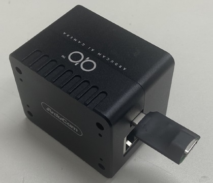
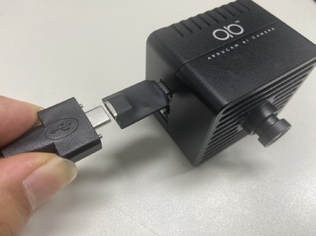
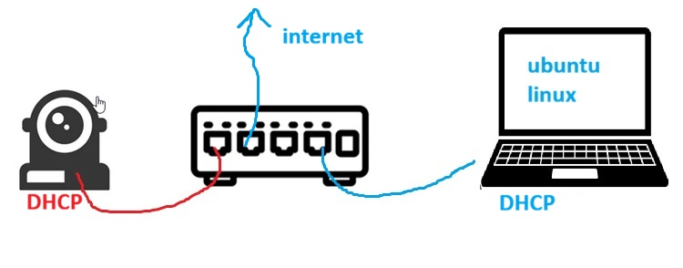
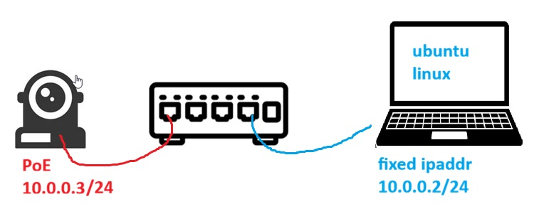

# qbastrial_ebvdemo
A self-installing, self-config script to install ebv demos on qb-astrial "vanilla" image.

The following instructions allow you to flash the camera with a prebuilt image (.wic), connect the camera to the network and then install the ebv simple demo (obj detection, pose detection, face landmarks, segmentation). The current demo requires to have the latest HailoRT > v.4.23 on the board to properly run the demos.

The final setup is composed by one or more qb-astrial, one PoE ethernet switch and a laptop to decode the video streams. The final setup is isolated from the internet and will run with fixed ip address for both qbastrial and laptop.

# flash qb-astrial 
To flash the camera you do NOT need the PoE switch, you need the USB cable from the camera to the pc (ubuntu linux)

You have downloaded your astrial image, make sure it is the correct one based on memory size (4gb or 8gb) of the module.
If the image is compressed (.wic.zst) the uncompress the image using the "unzst" command from commandline on your ubuntu pc.

Once ready follow these steps in this EXACT order:
## dongle insertion
Insert the dongle first, without attaching the usb cable to the pc



## pc connection
Insert the usb-c cable into the dongle and then into the pc.
IMPORTANT you must follow this exact order to avoid ESD damage while programming via usb.



## flashing
Once the camera is connected to the pc use the UUU command to flash the camera:

```
sudo uuu -b emmc_all ./imx-boot-astrial-8gb-imx8mp-sd.bin-flash_evk ./system-astrial-image-astrial-8gb-imx8mp.wic
```
If you do not have UUU installed you can get the command by typing:

```
wget https://github.com/nxp-imx/mfgtools/releases/download/uuu_1.5.125/uuu
chmod +x ./uuu
```
## disconnect and reboot
To disconnect the camera please follow the reverse order of operations: **first remove the cable from your pc, then remove the cable from the camera dongle (but leave the dongle inserted).** Last remove the dongle from the camera. Once again this is important for maximum ESD protection.

# setup for demo installation
For the demo installation both the camera and the pc are set for DHCP and you must connect the switch to a router connected to the internet. We will connect to the camera and fetch configuration from there.



## connection via ssh
QB-Astrial is a PoE camera so it will turn on when it is connected to the PoE switch.

From your Ubuntu PC open a command line shell (CLI) and use ssh to connect to the camera

```
ssh root@astrial-8gb-imx8mp.local
```

Once connected use the following command to fetch the demos and configure the camera for fixed-ip address:

```
curl -O -s https://raw.githubusercontent.com/gfilippi/qbastrial_ebvdemo/refs/heads/main/fetch.py && chmod 754 ./fetch.py && ./fetch.py
```

Once the procedure is done you can reboot the camera
```
sync
reboot
```
## disconnect internet and set your laptop for FIXED ip-address
Now the setup is completed and we do not need the internet cable anymore, remove the internet connection from the PoE switch.

Open your ubuntu network manager menu and set your laptop address for 10.0.0.2/24 (and "save" the setting)

Detach the ethernet cable from the laptop, wait 5 seconds, reconnect the ethernet cable.



Now from CLI you should be able to ping the camera using the command

```
ping 10.0.0.3
```

if this is successful ... you are all set! now you can carry the demo setup anywhere, you can also add more cameras by changing their ip address.

# Running the demo
On your laptop you only need two things: one console window and Firefox (or any other browser).

## run the decoder in console
in your console you need to run the script "client_gstreamer_astrial-h8.sh" available in this repo.
Note that you need to install GStreamer to be able to decode the RTP/H.264 video stream from the camera.

launch the script in console and let it run (waiting for incoming data...)

## open the camera control page
to control which demo you want to start open Firefox and point the page to (make sure it is HTTP and not HTTPs)

```
http://10.0.0.3
```

you will be presented with a set of demos.

First select "stop_streaming" and press "switch" button (just in case there is some previous stream ready)

Now select the demo you need and press "switch" button again.

After few seconds you should see the video on your PC.

## changing the ip-address of the camera
If you need to change the address of the camera itself connect via ssh and then edit (using nano) the file: /etc/systemd/network/20-wired.network

## fan control
the qbastrial-h8 is NOT fanless, and the speed is controlled by the CPU temperature, so it is normal to see the fan to spin up/down (make sure the fan is actually spinnning at boot) 

The qbastrial-h15 (using ASTRIAL-h15 version) can be used without a fan for normal ambient temperature operation.

# Clean shutdown
This is a very important step: before closing the demo make sure to select "shutdown_camera" and press the "switch" button. this will guarantee a clean shutdown of the camera itself.


